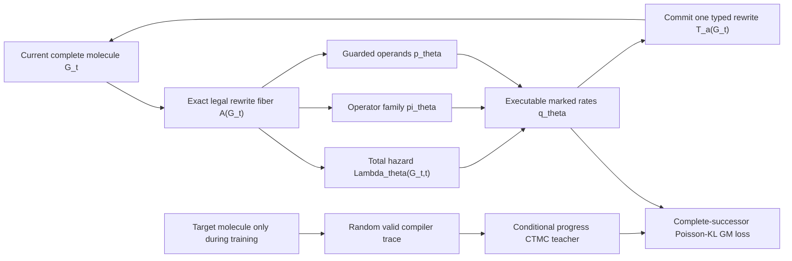

# Factorized C/N/O/F conditional Generator Matching gate

## Question

Can the exact rewrite semantics from the tiny enumerable experiment be scaled
to a held-out molecular corpus without exhaustive padding-slot proposals,
target access at sampling time, a fragment vocabulary, beam search, or repair?

## Model and process



The executable action fiber has six micro-rule families: atom
insert/delete/restate and bond insert/delete/reorder. For neutral C/N/O/F
states, hydrogen counts are derived from valence and equivalent null slots are
quotiented analytically. Every terminal masked action is still committed
through the production validator; a mask/runtime disagreement is an error.

The rate model factorizes

```text
q_theta(a | G,t)
  = Lambda_theta(G,t)
    pi_theta(rule(a) | G,t)
    p_theta(operands(a) | rule(a),G,t).
```

The model sees only the current whole graph and time. A target and randomized
compiler trace define a conditional teacher during training, but neither is
available to the production sampler. Sampling is a piecewise-frozen
time-inhomogeneous Gillespie/ancestral simulation, not search.

## Corpus and training protocol

- GuacaMol-derived local corpus, canonicalized and deduplicated.
- Neutral, connected C/N/O/F molecules with at most 12 heavy atoms.
- Deterministic split: 96 train, 16 validation, 16 untouched test; 21,410 input
  lines were scanned to obtain the 128 eligible molecules.
- Two randomized valid compiler traces per training molecule; one per
  validation/test molecule.
- Hidden width 64, three message-passing layers, 800 minibatch updates, batch
  size eight.
- Best checkpoint chosen by a fixed validation set; test metrics evaluated
  after selection.
- Training-time mixture: 50% uniform physical times in `[0.01, 0.99]`, 50%
  uniform operational times in `[0, 7]` mapped by `t = 1 - exp(-u)`.
- Sampling horizon `u=7`, time step `0.1`, maximum 32 events.

The late-time mixture is essential. The first corpus model was trained only up
to physical time 0.99 but sampled to approximately 0.9991. It therefore
extrapolated where the marginal jump hazard should shut down, producing too
many atom additions and ring closures. Matching the training-time support to
the sampling horizon fixes most of that error without changing the action
space or sampler.

## Held-out conditional-rate result

```text
metric                                  initial val   selected val   test
conditional GM loss                       18.436          4.457      4.049
teacher-successor probability mass          3.66%         20.83%     17.92%
top complete-successor accuracy              0.0%         32.00%     27.59%
mean hazard on terminal examples            0.686          0.238      0.254
```

The selected checkpoint is step 360. Losses use the mixed time measure and are
not numerically comparable to the earlier uniform-physical-time experiment.

## Target-free generation result

For 100 independent rollouts at `dt=0.1`:

```text
valid / connected / non-null                 100% / 100% / 100%
unique / novel to the 96 training molecules  100% / 100%
event-budget exhaustion                        0%
mean committed rewrites                       11.58
mean heavy atoms                      10.05   (reference 10.50)
mean heavy-atom bonds                 10.44   (reference 10.69)
mean cycle rank                        1.39   (reference 1.19)
atom-count total variation             0.157
cycle-rank total variation             0.442
element-distribution total variation   0.048
bond-order total variation             0.021
```

The generator used no target, target trace, endpoint oracle, fragment identity,
candidate bank, beam, or repair procedure. Exact reference-set recall is zero,
which is not itself a failure for de novo generation: every sample is novel to
this deliberately tiny training set. Distributional topology and chemical
quality, rather than memorization, are the relevant next gates.

The committed event mix was 87.05% atom insertion, 12.26% bond insertion, and
less than 0.7% combined deletion/restate/reorder events.

## Sampler and ablation diagnostics

Three independent 100-rollout evaluations gave:

```text
dt       valid   mean atoms   mean cycle rank   mean events
0.20     100%       10.09          1.23            11.38
0.10     100%       10.04          1.33            11.44
0.05     100%        9.54          1.03            10.61
reference            10.50          1.19              -
```

At this sample size there is ordinary Monte Carlo variation, but no observed
coarse-step validity failure or event-budget failure.

Useful negative and positive controls:

- Untrained factorized generator: mean 1.55 atoms, 17% null endpoints,
  atom-count TV 1.0, and only 36% unique outputs.
- Uniform-physical-time training: mean cycle rank 2.15 and mean terminal hazard
  1.07 in the controlled `dt=0.1` evaluation.
- Adding explicit graph-distance and global cycle context without fixing the
  time support was a negative result: mean 11.64 atoms and cycle rank 2.88.
- Late-time training without that context reduced primary-run cycle rank to
  1.39 and terminal hazard to 0.24. Rewrite context is therefore retained as an
  ablation, not enabled in the current baseline.

## What this establishes

- The exact validity-closed rewrite fiber can be factorized without changing
  its chemical successor set; measured fiber evaluation is 21-30 times faster
  on representative small molecules than exhaustive proposal validation.
- Conditional Generator Matching learns nontrivial held-out successor rates on
  a non-enumerated corpus.
- A null-source, target-free ancestral CTMC learns corpus-scale growth,
  composition, bond-order, and approximate ring statistics while preserving
  100% committed-state validity and connectedness.
- Training and sampling must cover the same operational-time horizon; endpoint
  calibration is part of the generative model, not a sampler afterthought.

## What this does not establish

- Competitive drug-like molecular generation, FCD, synthetic accessibility,
  stereochemistry, property conditioning, or 3D quality.
- Superiority to Edit Flows, Morph, DDSBM, diffusion, or fragment baselines.
- Scaling to realistic corpus sizes or larger action fibers.
- That every valid generated molecule is chemically plausible. Some samples
  remain strained or unusual, especially fused/bridged polycycles.
- A passed Phase 4 go/no-go gate.

## Next gate

Scale the same late-time-calibrated objective to thousands of neutral C/N/O/F
molecules with a larger atom cap, add FCD/NSPDK/QED/SA and ring-system
diagnostics, and compare against a corpus-marginal rewrite policy. Only then
revisit rewrite-context features, tree/fragment source ablations, richer
chemistry, or macro operators.
